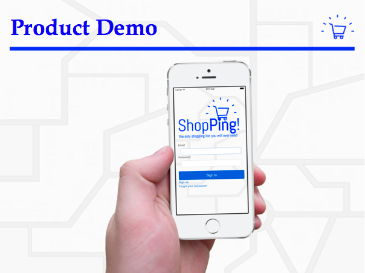
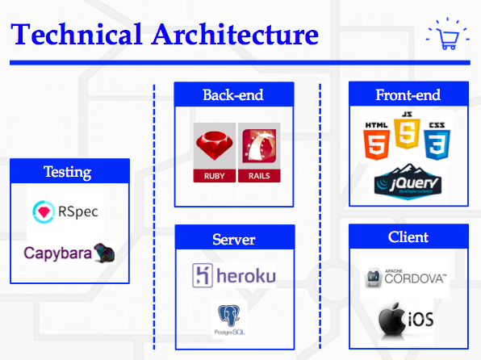

[](https://travis-ci.org/srMarquinho/shopping-list-app)
[](https://coveralls.io/github/srMarquinho/shopping-list-app?branch=master)

# ShopPing

<iframe width="560" height="315" src="https://www.youtube.com/embed/VPkfbeDOce8" frameborder="0" allowfullscreen></iframe>

 

- Ruby version: `2.3.0`
- Rails version: `5.0.0`
- Server: Run `bin/rails server` and `http://localhost:3000/`
- Configuration: Run `bundle install`
- Database creation: Run `bin/rails db:create`
- Test suite: Run `rspec`
- Made to iOS

User stories:

```text
As a user
So I know what to buy
I can view a list of items
```

```text
As a user
So I view my own list of item
I want to be able to sign in
```

```text
As a user
So I can modify my list
I want to add and remove items for the list
```

```text
As a user
So I can specify where to buy an item
I want to add a location of an item
```

```text
As a user
So I can be reminded to buy an item
I want to receive a notification when near the location of an item
```

```text
As a user
So I can no longer get notified
I want to check the item as completed
```
